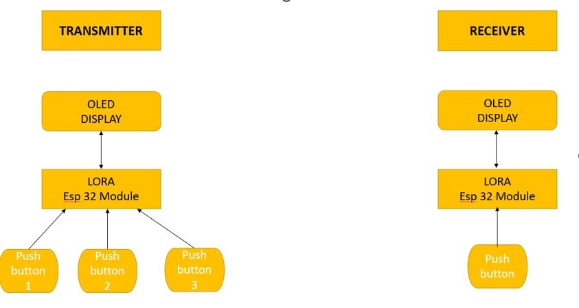
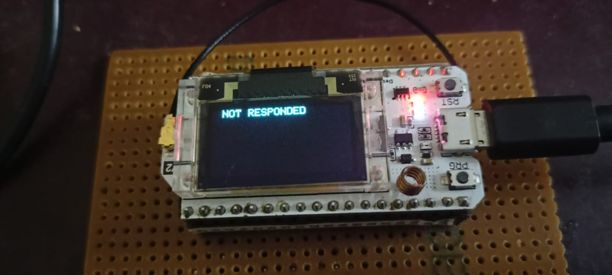
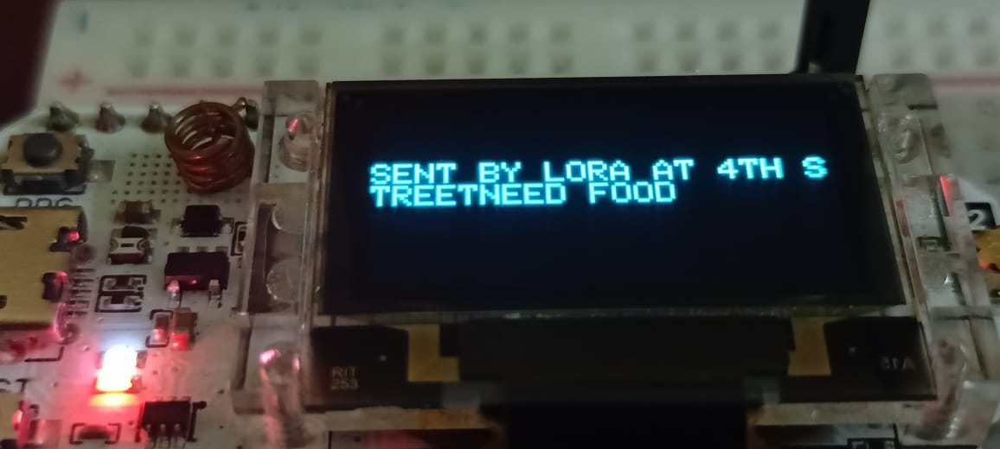
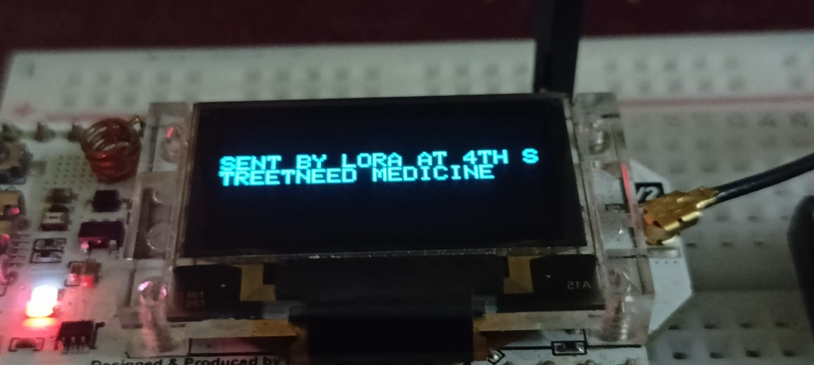

# Disaster-management-using-lora

We all know that India is a country which has almost 60% of its population
        in rural areas. And most of the villages in India don’t have proper communication facilities and in times
        of disaster’s the thing get worse. So in this project we will see how to connect with rural area people when
        there is a disaster.When ever there is a natural disaster then in most of the remote villages the
        communication network gets blocked. So in this case we can use this method to establish communication
        between disaster management committee and villagers. We use lora as a medium of communication in
        this scenario to establish communication network. Using this the disaster management committee
        committee authorities will be able to get into contact with the villagers and will be able to know the needs
        and requirements of the villagers.
    

     
    
We all know that India is a country which has almost 60% of its population
        in rural areas. And most of the villages in India don’t have proper communication facilities and in times
        of disaster’s the thing get worse. So in this project we will see how to connect with rural area people when
        there is a disaster.When ever there is a natural disaster then in most of the remote villages the
        communication network gets blocked. So in this case we can use this method to establish communication
        between disaster management committee and villagers. We use lora as a medium of communication in
        this scenario to establish communication network. Using this the disaster management committee
        committee authorities will be able to get into contact with the villagers and will be able to know the needs
        and requirements of the villagers.
    

     
    <h1 style="text-align: center;" >How to get started with heltec lora esp32 <a href="https://docs.heltec.org/en/node/esp32/quick_start.html" target="_blank" style="font-size: 2rem; ">Click here</a></h1>
     
    <h1 style="text-align: center;">FLOWCHART</h1>
      
    

        
    

    <h1 style="text-align: center;">TRANSMITER SIDE </h1>
     
    

        

            
            
        

        

            
        

        <h1 style="text-align: center;">RECEIVER SIDE </h1>
         
        

            

                
                
            

        

